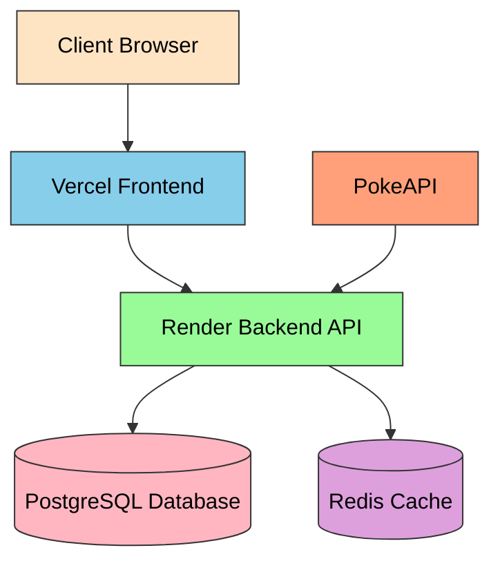
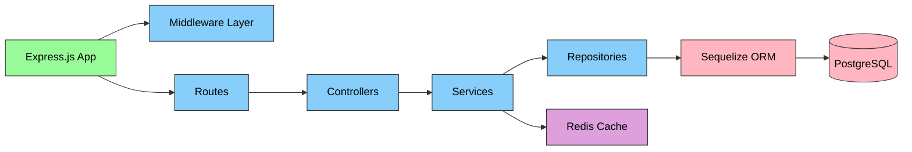
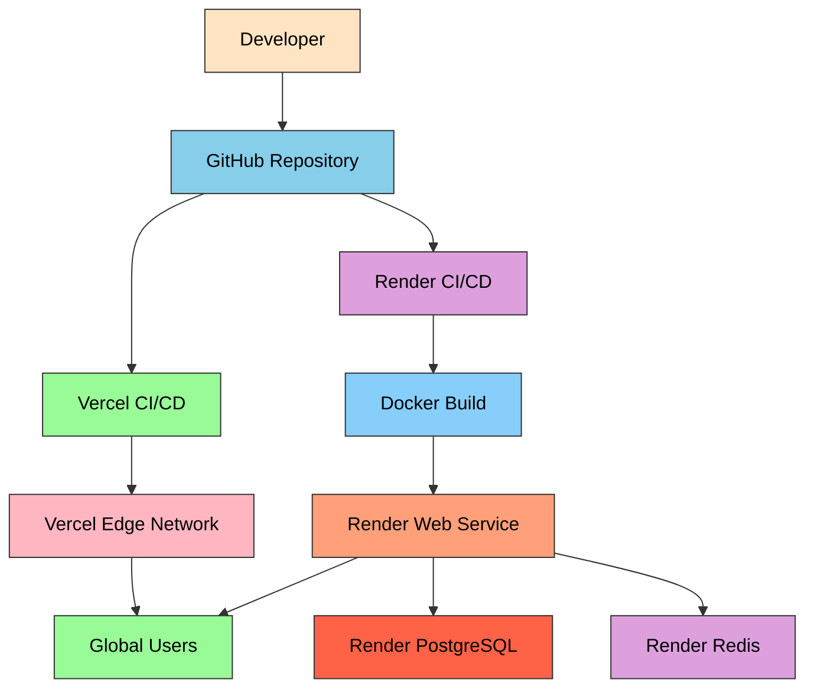
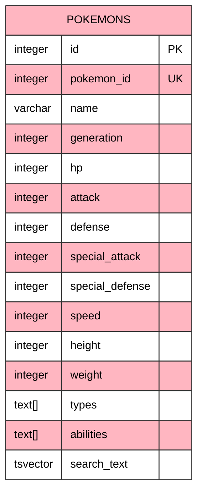
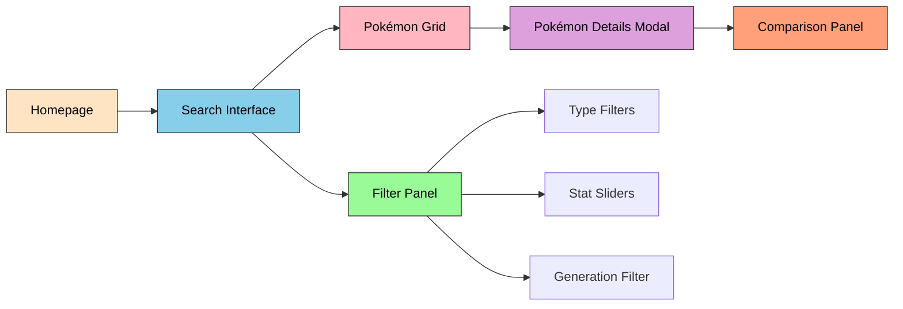
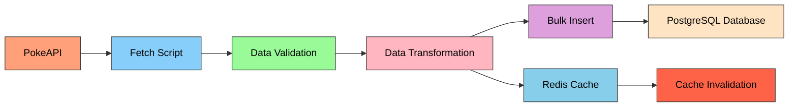

# PokéDex Solution Summary
## Architecture, Design & Implementation

### Architecture

#### System Design
The PokéDex application follows a modern microservices-inspired architecture with clear separation of concerns:

##### High-Level Architecture


##### Backend Component Architecture


1. **Frontend Layer** (React + TypeScript)
   - Single-page application with client-side routing
   - Component-based architecture with reusable UI elements
   - State management through React hooks and React Query for server state

2. **Backend Layer** (Node.js + Express)
   - RESTful API architecture with clear resource-based endpoints
   - Repository pattern for data access abstraction
   - Service layer for business logic separation
   - Middleware for cross-cutting concerns (logging, validation, error handling)

3. **Data Layer**
   - PostgreSQL for persistent storage with proper indexing
   - Redis for caching with 5-minute TTL for performance optimization
   - Sequelize ORM for database interactions with connection pooling

4. **Deployment Architecture**
   - Containerized backend with Docker for consistent environments
   - Independent scaling of frontend (Vercel) and backend (Render)
   - External managed services for database and cache

#### Technical Stack
- **Frontend**: React 18, TypeScript, Tailwind CSS, shadcn/ui, Vite
- **Backend**: Node.js, Express.js, TypeScript, Sequelize ORM
- **Database**: PostgreSQL with JSONB and array support
- **Cache**: Redis with automatic expiration
- **Deployment**: Docker, Vercel (frontend), Render (backend)

##### Deployment Architecture


### Design

#### Database Schema Design
The PostgreSQL schema is designed for optimal querying and search performance:

##### Entity Relationship Diagram


##### Table Schema
```sql
CREATE TABLE pokemons (
  id SERIAL PRIMARY KEY,
  pokemon_id INTEGER UNIQUE NOT NULL,
  name VARCHAR(255) NOT NULL,
  generation INTEGER NOT NULL,
  hp INTEGER NOT NULL,
  attack INTEGER NOT NULL,
  defense INTEGER NOT NULL,
  special_attack INTEGER NOT NULL,
  special_defense INTEGER NOT NULL,
  speed INTEGER NOT NULL,
  height INTEGER NOT NULL,
  weight INTEGER NOT NULL,
  types TEXT[] NOT NULL,  -- Array for multi-type support
  abilities TEXT[] NOT NULL,  -- Array for multiple abilities
  search_text TSVECTOR  -- For future full-text search enhancements
);
```

Key design decisions:
- Arrays for types and abilities to support PostgreSQL's powerful array operations
- Separate columns for all stats to enable efficient filtering
- Unique constraint on pokemon_id for data integrity
- Future-ready with search_text column for advanced full-text search

#### API Design
RESTful endpoints with consistent response structure:

```json
{
  "success": true,
  "data": [...],
  "meta": {
    "page": 1,
    "limit": 20,
    "total": 1350,
    "totalPages": 68
  }
}
```

Query parameters designed for flexibility:
- Text search with partial matching
- Multi-value filters (types, generations)
- Stat threshold filtering
- Flexible sorting options
- Pagination with configurable limits

#### UI/UX Design
Modern, responsive interface with:

##### User Interface Flow


Modern, responsive interface with:
- Grid and list view options
- Card sizing controls for personalization
- Type-based color coding for visual recognition
- Stat visualization with progress indicators
- Infinite scroll for seamless browsing
- Dark mode support
- Keyboard shortcuts for power users
- Mobile-first responsive design

### Implementation

#### Search Implementation
Two-tiered search approach:

1. **Full-Text Search**
   - PostgreSQL ILIKE operator for case-insensitive pattern matching
   - Searches across Pokémon names
   - Fast response times with database indexing

2. **Semantic Search**
   - Type-based filtering using PostgreSQL array overlap (&&)
   - Generation grouping for categorical filtering
   - Stat threshold filtering for numerical attributes
   - Combined filters with AND logic for precise results

##### Search Architecture

```mermaid
graph LR
    A[User Search Input] --> B[Frontend]
    B --> C[Backend API]
    C --> D[Redis Cache]
    D -- Cache Hit --> E[Return Cached Results]
    D -- Cache Miss --> F[Database Query]
    F --> G[PostgreSQL]
    G --> H[Apply Filters]
    H --> I[Sort Results]
    I --> J[Paginate Results]
    J --> K[Cache Results]
    K --> L[Return Results]
    E --> M[Frontend Display]
    L --> M
    
    style A fill:#FFE4C4,stroke:#333,color:#000
    style B fill:#87CEEB,stroke:#333,color:#000
    style C fill:#98FB98,stroke:#333,color:#000
    style D fill:#DDA0DD,stroke:#333,color:#000
    style E fill:#FFB6C1,stroke:#333,color:#000
    style F fill:#87CEFA,stroke:#333,color:#000
    style G fill:#FFA07A,stroke:#333,color:#000
    style H fill:#98FB98,stroke:#333,color:#000
    style I fill:#DDA0DD,stroke:#333,color:#000
    style J fill:#87CEEB,stroke:#333,color:#000
    style K fill:#FFB6C1,stroke:#333,color:#000
    style L fill:#FF6347,stroke:#333,color:#000
    style M fill:#FFE4C4,stroke:#333,color:#000
```


#### Performance Optimizations
1. **Caching Strategy**
   - Redis cache with 5-minute TTL
   - Cache keys based on complete query parameters
   - Automatic cache invalidation on data updates

2. **Database Optimizations**
   - Indexes on frequently queried fields (name, types, generation)
   - Connection pooling for efficient database access
   - Paginated queries to limit data transfer

3. **Frontend Optimizations**
   - Virtualized lists for smooth scrolling
   - Debounced search inputs to reduce API calls
   - React Query for intelligent caching and background updates
   - Code splitting for faster initial loads

##### Performance Flow

```mermaid
graph LR
    A[User Request] --> B[Frontend]
    B --> C[Check React Query Cache]
    C -- Hit --> D[Return Cached Data]
    C -- Miss --> E[API Call]
    E --> F[Check Redis Cache]
    F -- Hit --> G[Return Cached Response]
    F -- Miss --> H[Database Query]
    H --> I[PostgreSQL]
    I --> J[Apply Indexes]
    J --> K[Return Results]
    K --> L[Cache in Redis]
    L --> M[Cache in React Query]
    D --> N[Display]
    G --> N
    M --> N
    
    style A fill:#FFE4C4,stroke:#333,color:#000
    style B fill:#87CEEB,stroke:#333,color:#000
    style C fill:#98FB98,stroke:#333,color:#000
    style D fill:#FFB6C1,stroke:#333,color:#000
    style E fill:#87CEFA,stroke:#333,color:#000
    style F fill:#DDA0DD,stroke:#333,color:#000
    style G fill:#FFA07A,stroke:#333,color:#000
    style H fill:#98FB98,stroke:#333,color:#000
    style I fill:#FFB6C1,stroke:#333,color:#000
    style J fill:#87CEEB,stroke:#333,color:#000
    style K fill:#DDA0DD,stroke:#333,color:#000
    style L fill:#FF6347,stroke:#333,color:#000
    style M fill:#98FB98,stroke:#333,color:#000
    style N fill:#FFE4C4,stroke:#333,color:#000
```


#### Error Handling & Observability
1. **Error Management**
   - Centralized error handling middleware
   - Consistent error response format
   - Proper HTTP status codes
   - Input validation with detailed error messages

2. **Logging & Monitoring**
   - Structured request logging
   - Performance metrics collection
   - Error tracking and reporting

#### Data Processing Pipeline
1. **Data Acquisition**
   - Direct integration with PokeAPI
   - Batch processing for efficient data fetching
   - Rate limiting compliance

2. **Data Transformation**
   - Normalization of inconsistent API responses
   - Calculation of derived fields
   - Data cleaning and validation

3. **Data Storage**
   - Transactional writes for data consistency
   - Bulk insert operations for seeding efficiency
   - Conflict resolution for duplicate prevention

##### Data Seeding Flow


### Key Features Implementation

#### Infinite Scroll
Implemented with IntersectionObserver API:
- Maintains scroll position during page transitions
- Preloads next page when approaching viewport bottom
- Handles loading states and error conditions gracefully
- Optimized rendering with virtualization

#### Filtering System
Multi-dimensional filtering with:
- Type filtering using PostgreSQL array operations
- Generation-based categorical filtering
- Stat threshold sliders for numerical filtering
- Combined filter logic with proper precedence

#### Responsive Design
Mobile-first approach with:
- Adaptive grid layouts
- Touch-friendly controls
- Orientation-aware components
- Performance optimizations for mobile networks

### Scalability Considerations

#### Horizontal Scaling
- Stateless backend services for easy replication
- Database connection pooling for concurrent access
- Redis clustering support for cache distribution
- CDN-ready static assets

#### Future Enhancements
- Elasticsearch integration for advanced full-text search
- GraphQL API for flexible data querying
- WebSocket support for real-time updates
- Machine learning for personalized recommendations

### Security Measures
- CORS protection with origin whitelisting
- Input sanitization and validation
- SQL injection prevention through ORM
- Rate limiting for API abuse prevention
- Secure environment variable management

---

**Assessment Criteria Addressed:**
✅ **Architecture**: Clean separation of concerns with scalable design  
✅ **Design**: Modern UI/UX with responsive, accessible components  
✅ **Implementation**: Production-grade code with TypeScript, error handling, and performance optimizations